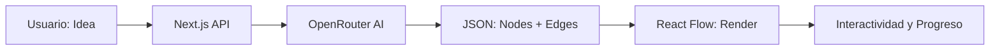

# 🧭 DevMap — Tu Waze de Código

[](https://nextjs.org/)
[](https://tailwindcss.com/)
[](https://reactflow.dev/)
[](https://openrouter.ai/)

**DevMap** es una herramienta inteligente que transforma una idea de software en un **mapa visual interactivo de desarrollo**. Olvida las listas interminables; DevMap te muestra qué construir, en qué orden y por qué, guiándote a través de un grafo de dependencias lógico.

---

## 📽️ Demo en Acción


---

## 🎯 El Problema
Muchos desarrolladores, especialmente quienes están iniciando, se enfrentan a la **parálisis por análisis**:
*   🚫 No saben por dónde empezar un proyecto.
*   😵 Se sienten abrumados por la complejidad técnica.
*   🧩 No comprenden cómo se conectan las diferentes partes (base de datos, auth, frontend).

## 💡 La Solución
DevMap convierte una idea simple (ej. *"Clon de Twitter con Supabase"*) en una **Ruta de Misiones** clara:
1.  **Mapa Visual (Grafo):** Visualiza la arquitectura y el flujo de trabajo.
2.  **Misiones Secuenciales:** Cada nodo es una feature con subtareas, recursos y stack técnico.
3.  **Progreso en Vivo:** Marca tus misiones como completadas y observa cómo avanzas en tu "XP de Proyecto".

---

## ✨ Características Principales

*   🧠 **Arquitecto IA:** Generación dinámica de rutas basada en lenguaje natural a través de OpenRouter.
*   📡 **Streaming Real-time:** Mira cómo el mapa se construye frente a tus ojos mientras la IA procesa tu idea.
*   🗂️ **Detalle de Nodo Pro:** Cada paso incluye instrucciones, enlaces a documentación oficial y tips técnicos.
*   💾 **Auto-Save:** Tu progreso se guarda localmente para que nunca pierdas el hilo.
*   🚀 **UI Premium:** Interfaz oscura, minimalista y fluida diseñada para la máxima concentración.

---

## 🛠️ Stack Tecnológico

*   **Framework:** [Next.js 15](https://nextjs.org/) (App Router)
*   **Visualización:** [React Flow](https://reactflow.dev/)
*   **Styling:** [Tailwind CSS](https://tailwindcss.com/) con animaciones personalizadas.
*   **IA:** [OpenRouter](https://openrouter.ai/) (Modelos LLM de última generación).
*   **Deployment:** Preparado para [CubePath](https://cubepath.com/).

---

## 🚀 Cómo Empezar

### Requisitos Previos
*   Node.js 18+ 
*   Una API Key de OpenRouter (configurada en `.env.local`)

### Instalación
1.  Clona el repositorio:
    ```bash
    git clone https://github.com/tu-usuario/devmap.git
    ```
2.  Instala las dependencias:
    ```bash
    npm install
    ```
3.  Configura tus variables de entorno en `.env.local`:
    ```env
    OPENROUTER_API_KEY=tu_api_key_aqui
    ```
4.  Inicia el servidor de desarrollo:
    ```bash
    npm run dev
    ```

---

## 🔄 Flujo de Datos


---

## 🏆 Objetivo
DevMap nació para la hackatón con un objetivo claro: **Eliminar la confusión del proceso creativo y darle a cada desarrollador un GPS exacto hacia su MVP.**

> "DevMap te dice exactamente qué hacer primero."

---
*Desarrollado con ❤️ para la comunidad dev.*
